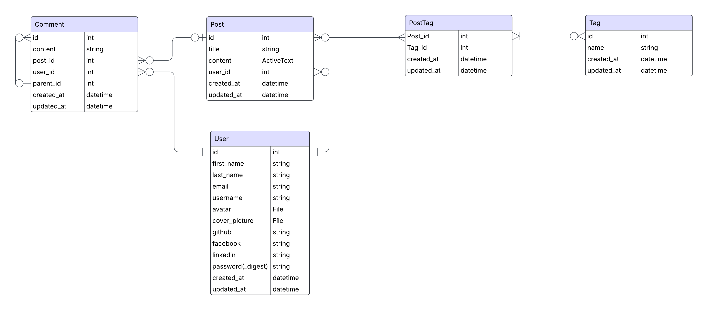

# Thiết kế cơ sở dữ liệu

Tài liệu này mô tả thiết kế cơ sở dữ liệu cho **DevShare Lite**, một nền tảng diễn đàn công nghệ được xây dựng với **Ruby on Rails** và **NextJS**. Sử dụng hệ quản trị cơ sở dữ liệu **PostgreSQL**

## Tổng quan các bảng

Dự án bao gồm các bảng chính sau:

- `users`: Lưu thông tin tài khoản và hồ sơ người dùng.
- `posts`: Bài viết với nội dung văn bản phong phú và ảnh đính kèm.
- `comments`: Hệ thống bình luận hỗ trợ trả lời một cấp độ.
- `tags`: Cho biết bài viết liên quan đến chủ đề nào.
- `post_tags`: Bảng liên kết để tạo quan hệ nhiều-nhiều giữa posts và tags.

## Sơ đồ mối quan hệ thực thể

## users

| Tên trường     | Kiểu     | Mô tả                                   |
|----------------|----------|-----------------------------------------|
| id             | integer  | Khóa chính                              |
| first_name     | string   | Tên                                     |
| last_name      | string   | Họ                                      |
| email          | string   | Địa chỉ email (duy nhất)                |
| username       | string   | Tên hiển thị                            |
| avatar         | tệp tin  | Ảnh đại diện                            |
| cover_picture  | tệp tin  | Ảnh bìa                                 |
| github         | string   | Đường dẫn GitHub                        |
| facebook       | string   | Đường dẫn Facebook                      |
| linkedin       | string   | Đường dẫn LinkedIn                      |
| password_digest| string   | Mật khẩu đã mã hóa                      |
| created_at     | datetime | Thời gian tạo bản ghi                   |
| updated_at     | datetime | Thời gian cập nhật bản ghi              |

##  posts

| Tên trường  | Kiểu       | Mô tả                                      |
|-------------|------------|--------------------------------------------|
| id          | integer    | Khóa chính                                 |
| title       | string     | Tiêu đề bài viết                           |
| content     | ActionText | Nội dung phong phú (dùng CKEditor hoặc Trix)|
| user_id     | integer    | Khóa ngoại đến bảng `users`               |
| created_at  | datetime   | Thời gian tạo                             |
| updated_at  | datetime   | Thời gian cập nhật                        |

**Quan hệ**:

- Thuộc về một `user`
- Có nhiều `tags` thông qua `post_tags`
- Có nhiều `comments`

---

## comments

| Tên trường   | Kiểu     | Mô tả                                      |
|--------------|----------|---------------------------------------------|
| id           | integer  | Khóa chính                                  |
| content      | string   | Nội dung bình luận                          |
| post_id      | integer  | Khóa ngoại đến bảng `posts`                |
| user_id      | integer  | Khóa ngoại đến bảng `users`                |
| parent_id    | integer  | Khóa ngoại đến chính bảng `comments` (có thể null) |
| created_at   | datetime | Thời gian tạo                               |
| updated_at   | datetime | Thời gian cập nhật                          |

**Lưu ý**:
- Chỉ hỗ trợ **một cấp độ trả lời** (không thể trả lời lại một câu trả lời).
- Những bình luận gốc sẽ có `parent_id = null`.

---

## tags

| Tên trường   | Kiểu     | Mô tả                                      |
|--------------|----------|---------------------------------------------|
| id           | integer  | Khóa chính                                  |
| name         | string   | Tên tag                                     |
| created_at   | datetime | Thời gian tạo                               |
| updated_at   | datetime | Thời gian cập nhật                          |

**Quan hệ**:

- Có nhiều `posts` thông qua `post_tags`

## post_tags (bảng nối)

| Tên trường   | Kiểu     | Mô tả                                      |
|--------------|----------|---------------------------------------------|
| post_id      | integer  | Khóa ngoại đến bảng `posts`                |
| tag_id       | integer  | Khóa ngoại đến bảng `tags`                 |
| created_at   | datetime | Thời gian tạo                               |
| updated_at   | datetime | Thời gian cập nhật                          |

**Quan hệ**:

- Thuộc về một `post`
- Thuộc về một `user`

## Ghi chú 

- Content của post được xử lý bằng `ActionText`, hỗ trợ ảnh đính kèm thông qua **Active Storage**.
- Avatar và ảnh cover của user cũng được lưu trữ bằng **Active Storage**
- Hệ thống đăng nhập/đăng ký sử dụng `Devise` và xác thực thông qua `JWT`.
