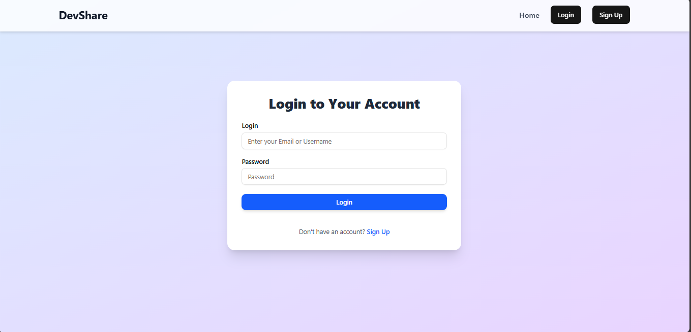
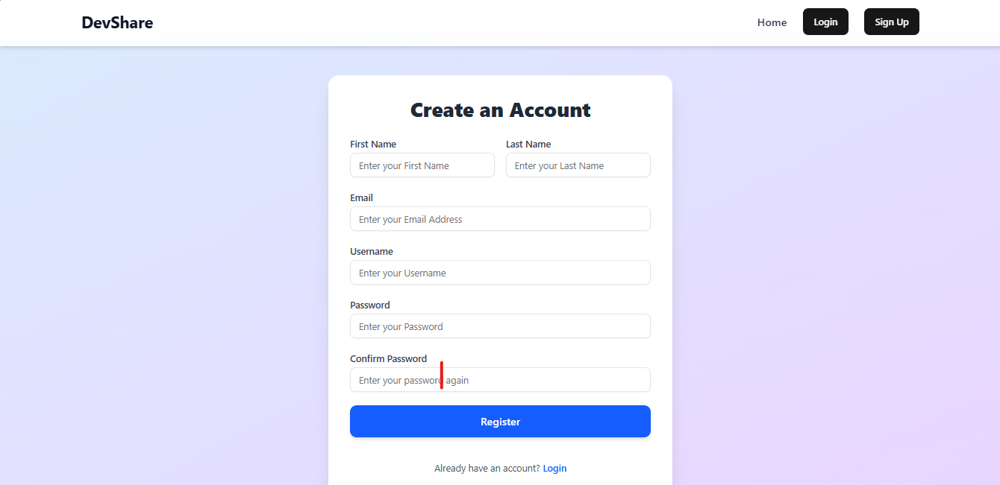
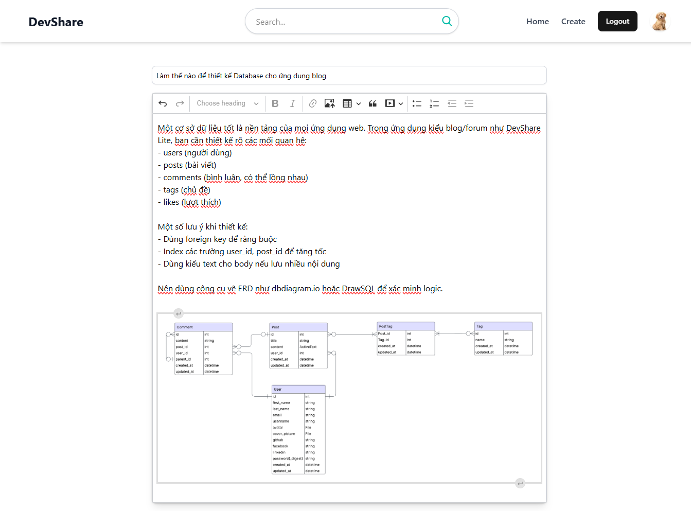
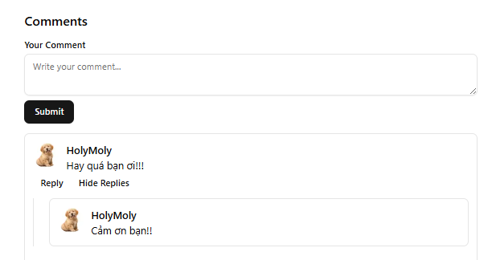
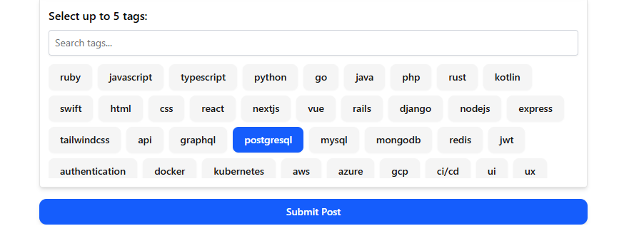
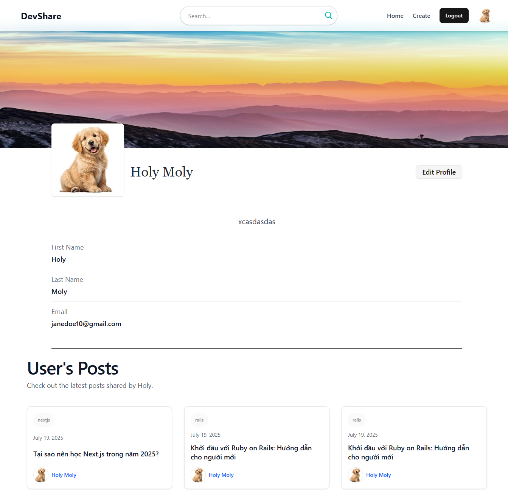
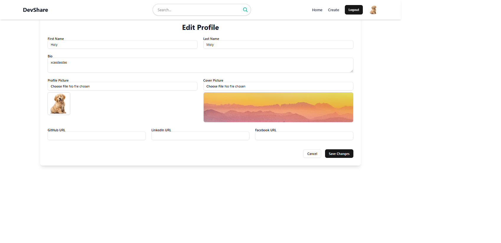

# Tính năng của DevShare Lite

## Các chức năng chính

DevShare Lite là một nền tảng diễn đàn chia sẻ kiến thức và thảo luận công nghệ. Các chức năng chính bao gồm:

### Đăng ký / Đăng nhập người dùng (Devise + JWT)

### Tạo bài viết 

### Bình luận và trả lời bình luận (1 cấp) trên bài viết

### Hệ thống gắn thẻ bài viết 

### Trang cá nhân người dùng với avatar, ảnh cover, social links, và thông tin kỹ năng

### Chỉnh sửa thông tin tài khoản, upload ảnh bìa và avatar

### Danh sách bài viết, phân trang, tìm kiếm bài viết theo tiêu đề

### Giao diện responsive (Tailwind CSS + ShadCN UI)

## Chức năng nâng cao đã thực hiện

- Tạo bài viết, tải ảnh trực tiếp với trình soạn thảo rich text (CKEditor + ActiveText) hoạt động hoàn chỉnh với backend Rails
- Hỗ trợ **ảnh đại diện** và **ảnh bìa** cho người dùng

## Các vấn đề đã gặp và giải pháp

| Vấn đề | Giải pháp |
|-------|-----------|
| Không thể upload ảnh từ CKEditor lên backend | Tự tạo custom upload adapter gửi ảnh lên `/uploads`, backend dùng `ActiveStorage::Blob.create_and_upload!` |
| Chậm khi load hết toàn bộ comment | Tách API thành 2 phần: lấy root comments (`parent_id: null`) và replies riêng  |
| Quản lý token đăng nhập rườm rà | Lưu JWT trong `localStorage`, tạo `AuthContext` để chia sẻ trạng thái người dùng trong frontend |
| Token hết hạn bên backend nhưng bên frontend vẫn cho phép vào các trang cần đăng nhập | Khi frontend khởi động, sử dụng AuthContext để gọi API /current_user với JWT từ localStorage. Nếu token hết hạn hoặc không hợp lệ, backend trả lỗi, frontend sẽ tự động xóa token khỏi localStorage, cập nhật trạng thái isLoggedIn thành false, và điều hướng người dùng về trang đăng nhập. Điều này giúp đảm bảo chỉ người dùng hợp lệ mới truy cập được các trang cần đăng nhập.|

## Giới hạn hiện tại

- Không xác minh token nếu như trang không được refresh. Dẫn đến việt sẽ có lúc trang sẽ load nhưng toàn bộ posts hoặc những thứ cần đăng nhập bị lỗi.
- Xác minh token chưa tối ưu. Quá trình kiểm tra token không tức thời, dẫn đến popup yêu cầu đăng nhập hiển thị tức thời dù token vẫn hợp lệ. Điều này có thể gây khó chịu cho người dùng.
- Trình soạn thảo chưa hỗ trợ video, chỉ hỗ trợ ảnh và text
- Không có tính năng thông báo (notifications)
- Không có hệ thống Like / Vote cho bài viết và bình luận
- Chưa có phân quyền (admin / moderator)
- Hệ thống chưa bảo mật

## Định hướng tương lai

- Thêm hệ thống **like** cho posts và comments
- Thêm phân quyền xem cho posts
- Cho phép **chỉnh sửa / xoá** bình luận 
- Thêm **chức năng bookmark** bài viết
- Thêm **phân quyền người dùng**: admin
- Thêm **mailer** để xác nhận khi đăng ký, đổi email, mật khẩu
- Giao diện tối (dark mode)

